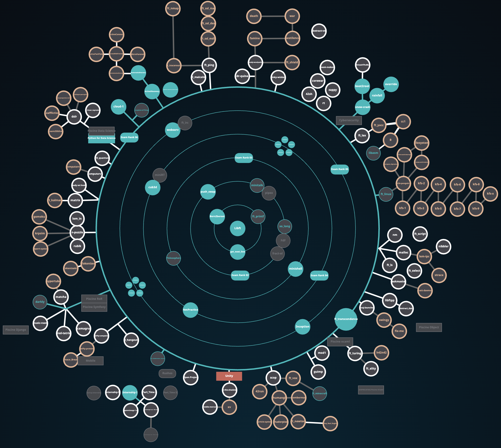

# 42_Common_Core

The 42 Common Core is the secret sauce that makes the 42 curriculum unique. It is a set of common skills and knowledge that all students are expected to master in programming, algorithms, and computer science. Each "circle" represents a different area of expertise, and students are expected to complete all 6 circles to be free from the Black Hole and open the doors of specialization and professionalization.

### Each circle learns a different set of skills:
- ## <u>[**Circle 1**](https://github.com/Nimpoo/42_Common_Core/tree/main/0_circle)</u>:
1. Creation of our **library, the [`libft`](https://github.com/Nimpoo/42_Common_Core/tree/main/0_circle/libft), learning the **basics of C programming**, what is a **library**, **compilation**, **linking**, **pointers**, **memory allocation**, and the **Makefile**.

- ## <u>[**Circle 1**](https://github.com/Nimpoo/42_Common_Core/tree/main/1st_circle)</u>:
1. Recreation of a simplify version of the `printf` function, learning about variadic functions, and how to handle different data types : [`ft_printf`](https://github.com/Nimpoo/42_Common_Core/tree/main/1st_circle/ft_printf).
2. Learning about **file descriptors**, **system calls**, and how to handle input/output in `C`:  [`get_next_line`](https://github.com/Nimpoo/42_Common_Core/tree/main/1st_circle/get_next_line).
3. And learning about **Virtual Machine**, setting up an OS, like **Debian**. This third project of the circle is not present in my repository, as it is not a coding project but rather a setup project (even if I can provide the setup steps if needed). It's named `Born2BeRoot`

- ## <u>[**Circle 2**](https://github.com/Nimpoo/42_Common_Core/tree/main/2nd_circle)</u>:
1. Learning about **data structures**, **linked lists**, and how to manipulate them combined by learning how to implemante a **sorting algorithm**: [`push_swap`](https://github.com/Nimpoo/42_Common_Core/tree/main/2nd_circle/push_swap).
2. Learning about **memory management**, **dynamic memory allocation**, and use of a **graphic library**: [`so_long`](https://github.com/Nimpoo/42_Common_Core/tree/main/2nd_circle/so_long).
3. Learning about **signals**, **processes**, **server and client** communication: [`minitalk`](https://github.com/Nimpoo/42_Common_Core/tree/main/2nd_circle/minitalk).

- ## <u>[**Circle 3**](https://github.com/Nimpoo/42_Common_Core/tree/main/3rd_circle)</u>:
1. Learning about **multithreading**, **mutexes**, and how to handle multiple threads in a program: [`philosophers`](https://github.com/Nimpoo/42_Common_Core/tree/main/3rd_circle/philosophers).
2. Creation of a **shell**, learning about **parsing**, **execution of commands**, and a lot of other concepts related to shell programming: [`minishell`](https://github.com/Nimpoo/42_Common_Core/tree/main/3rd_circle/minishell).

- ## <u>[**Circle 4**](https://github.com/Nimpoo/42_Common_Core/tree/main/4th_circle)</u>:
1. Learning the method of **RayCasting** to create a **3D game**: [`cub3D`](https://github.com/Nimpoo/42_Common_Core/tree/main/4th_circle/cub3D).
2. Learning the of a new programming language, `C++`, it's the `C++ Pool`, we learn all the fundamentals of `C++`, like **classes**, **inheritance**, **polymorphism**, **templates**, and more: [`cpp_pool`](https://github.com/Nimpoo/42_Common_Core/tree/main/4th_circle/CPP_modules).

- ## <u>[**Circle 5**](https://github.com/Nimpoo/42_Common_Core/tree/main/5th_circle)</u>:
1. Learning about **networking**, **HTTP**, and how to create a web server: [`webserv`](https://github.com/Nimpoo/42_Common_Core/tree/main/5th_circle/webserv).
2. Learning about **containers**, **docker**, and how to create a containerized application and deploy it: [`inception`](https://github.com/Nimpoo/42_Common_Core/tree/main/5th_circle/inception).

- ## <u>**Circle 6**</u>:
1. Creation of a complete **web application** with a full stack, using `React`, `Next.js`, `Python Django`, and a lot of other techno: [`ft_transcendence`](https://github.com/Nimpoo/ft_transcendence).

Doing all these projects are not sufficient to come to the superior circle. You need to pass the **[exams of each circle]((https://github.com/Nimpoo/42_Common_Core/tree/main/exam_42))** to be able to go to the next one.

# And this is how the 42 Common Core is represented, by the <u>Holy Graph</u>:
